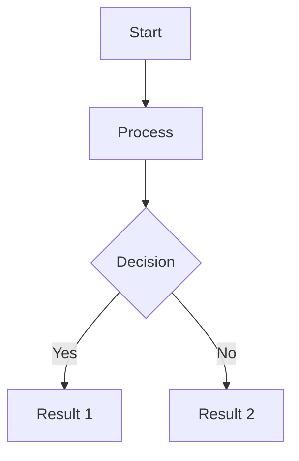

# Markdown Viewer

> **The best lightweight code viewer for macOS** – Experience blazing-fast markdown, mermaid diagrams, HTML, and JSON visualization in a beautiful, native application.

A lightning-fast, ultra-lightweight macOS application built with Tauri for viewing and editing code files. With specialized renderers for Markdown (including Mermaid diagrams), HTML, and JSON, this is your go-to tool for documentation, data, and code visualization.

## Why Choose This Viewer?

- ⚡ **Ultra-Lightweight**: Only 5-10MB bundle size (vs 150MB+ for Electron apps)
- 🚀 **Blazing Fast**: Native performance with <100MB memory footprint
- 🎨 **Beautiful Rendering**: Professional-grade markdown with custom mermaid diagram themes
- 🔒 **Secure**: Sandboxed HTML preview protects against malicious code
- 💻 **Native macOS**: Built with Tauri for true native performance

## Features

### 📝 Markdown Viewer
- **Stunning GitHub-flavored Markdown rendering** with syntax-highlighted code blocks
- **Mermaid diagram support** with custom color palette for beautiful flowcharts, sequence diagrams, and more
- **Toggle between rendered and raw edit modes** with `Cmd+Shift+M`
- **Live preview** updates as you type

### 🌐 HTML Viewer
- **Sandboxed HTML preview** for secure rendering
- **Toggle between rendered preview and raw code** with `Cmd+Shift+H`
- **See your HTML come to life** while maintaining security

### 📊 JSON Viewer
- **Beautiful tree view** with collapsible nodes for exploring complex data structures
- **Format and minify** tools built-in
- **Toggle between tree and raw edit modes** with `Cmd+Shift+J`
- **Perfect for API responses and configuration files**

### 🎯 Advanced Code Editor
- **Monaco Editor** – The same powerful editor that powers VS Code
- **Syntax highlighting** for 25+ programming languages
- **Command palette integration** (Cmd+F1 or right-click)
- **IntelliSense-ready** for supported languages

### 🗂️ File Management
- **Tabbed interface** for working with multiple files simultaneously
- **Create new files** from templates (Markdown, HTML, JSON, JavaScript, TypeScript, CSS, Python, and more)
- **Smart file type detection** – Files open with the appropriate viewer
- **Quick file operations** with intuitive keyboard shortcuts

### ⌨️ Keyboard Shortcuts
Power user friendly with comprehensive keyboard support:

- `Cmd+N`: Create new file from template
- `Cmd+O`: Open file
- `Cmd+S`: Save file
- `Cmd+W`: Close current tab
- `Cmd+Shift+M`: Toggle Markdown view mode
- `Cmd+Shift+J`: Toggle JSON view mode
- `Cmd+Shift+H`: Toggle HTML view mode
- `Cmd+F1`: Open command palette

## Technology Stack

Built with modern, high-performance technologies:

- **Frontend**: React 18 + TypeScript 5.3 + Vite 5
- **Backend**: Tauri 1.5 (Rust) – For native performance
- **Editor**: Monaco Editor – VS Code's editor component
- **Markdown**: marked.js with highlight.js for syntax highlighting
- **Mermaid**: mermaid.js with custom theme configuration
- **JSON**: react-json-view-lite for tree visualization

## Quick Start

```bash
# Install dependencies
npm install

# Run in development mode
npm run tauri dev

# Build for production
npm run tauri build
```

## Supported File Types

### Special Viewers
- **Markdown** (`.md`) – Full rendering with mermaid diagrams
- **HTML** (`.html`) – Sandboxed preview
- **JSON** (`.json`) – Interactive tree view

### Code Editor Support
- JavaScript (`.js`, `.jsx`)
- TypeScript (`.ts`, `.tsx`)
- CSS (`.css`, `.scss`, `.sass`)
- Python (`.py`)
- Rust (`.rs`)
- Go (`.go`)
- Java (`.java`)
- YAML (`.yml`, `.yaml`)
- XML (`.xml`)
- SQL (`.sql`)
- Shell scripts (`.sh`, `.bash`)
- And many more...

## Mermaid Diagram Support

Create beautiful diagrams directly in your markdown:

````markdown

````

Supports all mermaid diagram types:
- Flowcharts
- Sequence diagrams
- Class diagrams
- State diagrams
- Gantt charts
- Pie charts
- Git graphs
- And more!

## Performance

- **Bundle Size**: ~5-10MB (production build)
- **Memory Usage**: <100MB with multiple large files open
- **Startup Time**: <1 second
- **Platform**: macOS 11.0+

## Project Structure

```
├── src/                    # React frontend
│   ├── components/        # UI components
│   │   ├── TabBar/       # Tab management component
│   │   └── Viewers/      # Specialized viewers
│   │       ├── MarkdownViewer.tsx  # Markdown + Mermaid
│   │       ├── HtmlViewer.tsx      # HTML preview
│   │       ├── JsonViewer.tsx      # JSON tree view
│   │       └── CodeEditor.tsx      # Monaco editor wrapper
│   ├── hooks/            # React hooks for state management
│   ├── types/            # TypeScript type definitions
│   └── App.tsx           # Main application component
├── src-tauri/            # Rust/Tauri backend
│   ├── src/main.rs       # File system operations
│   └── Cargo.toml        # Rust dependencies
└── package.json          # npm dependencies
```

## Building for Production

```bash
# Build the application
npm run tauri build

# The built app will be in:
# src-tauri/target/release/bundle/
```

### App Icon (Optional)

Before building for production, you can generate custom app icons:

```bash
# Create a 1024x1024 PNG icon first, then:
npm run tauri icon path/to/icon.png
```

## Use Cases

Perfect for:
- 📚 **Documentation writers** – Beautiful markdown preview with diagrams
- 🔧 **Developers** – Quick code file viewer with syntax highlighting
- 📊 **Data analysts** – JSON data exploration and formatting
- 🎨 **Web designers** – HTML preview and editing
- 📝 **Note takers** – Markdown with mermaid for visual notes
- 🔍 **Code reviewers** – Fast, lightweight file inspection

## Contributing

Contributions are welcome! This is a lightweight, focused tool – let's keep it that way.

## License

MIT License – Free to use, modify, and distribute.

---

**Made with ❤️ using Tauri, React, and TypeScript**
